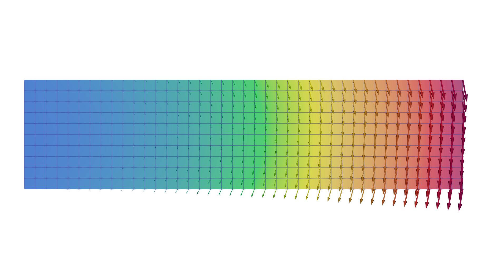

# FEM solver for cantilever beam
A personal project to show my academic output and skillset.

## Cloning the Repository
To clone the repository with its submodules,
```
git clone --recurse-submodules https://github.com/watf-dev/FEM_Beam.git
```
To add the directory to the PATH, for example,
```
echo 'export PATH=$PATH:/path/to/directory' >> ~/.zshrc
source ~/.zshrc
```

## Mesh Generation
Currently, a TEST mesh is available in the public directory.

## Configuration
To edit the material properties in the setting section of `FEM_implement.py`, open the file and change values if needed;
- E: Young's modulus
- nu: Poisson's ratio
- Py: vertical load on the edge of right top

## Running the Solver
```
./run.sh
```

## Visualization with ParaView
Visualization of the results, example for slaced displacement of each node;

